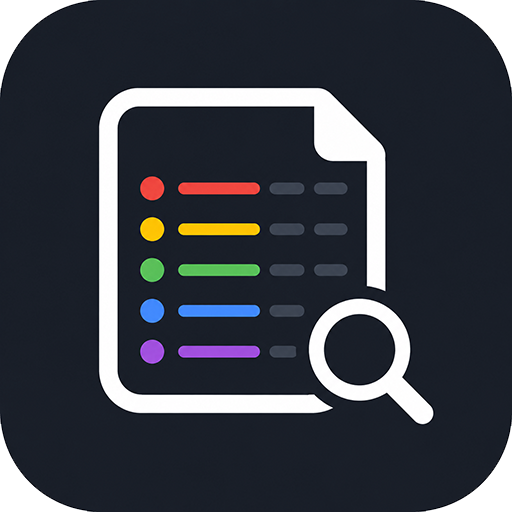
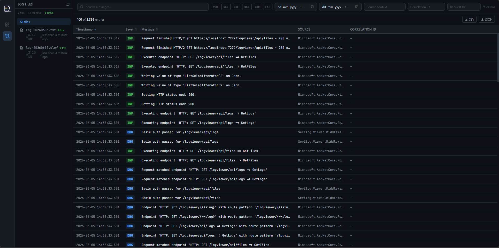

<div align="center">
  
  <h1>Serilog.Viewer</h1>
  <p>A lightweight, embeddable log viewer for ASP.NET Core applications using Serilog structured logging.<br/>Browse, filter, and search log files through a modern React UI — served directly from your running application.</p>

  [](https://www.nuget.org/packages/Serilog.Viewer/)
  [](https://www.nuget.org/packages/Serilog.Viewer/)
  [](LICENSE)
  [](https://dotnet.microsoft.com/)
</div>

---

## Screenshots


<!--  -->
<!--  -->

---

## Features

- **Dashboard** — at-a-glance stats with charts for errors, warnings, and log volume over time
- **Log Explorer** — paginated log browser with full-text search, level filtering, and date range selection
- **Live Tail** — real-time streaming of new log entries via SignalR (optional add-on)
- **Multiple log formats** — parses plain-text (`.log`/`.txt`) and CLEF compact JSON (`.clef`/`.json`)
- **Basic Authentication** — optional username/password gate for the `/logviewer` route
- **Zero client dependencies** — the React SPA is bundled into the NuGet package and served as static assets; no separate frontend deployment needed
- **Multi-framework** — targets .NET 8 and .NET 9

---

## Packages

| Package | NuGet | Description |
|---|---|---|
| `Serilog.Viewer` | [](https://www.nuget.org/packages/Serilog.Viewer/) | Core middleware, log reading, and React UI |
| `Serilog.Viewer.Realtime` | *(coming soon)* | Optional SignalR extension for live log tailing |

---

## Getting Started

### 1. Install the NuGet package

```shell
dotnet add package Serilog.Viewer
```

### 2. Configure Serilog to write log files

```csharp
Log.Logger = new LoggerConfiguration()
    .WriteTo.File(
        new CompactJsonFormatter(),
        "Logs/log-.clef",
        rollingInterval: RollingInterval.Day)
    .CreateLogger();

var builder = WebApplication.CreateBuilder(args);
builder.Host.UseSerilog();
```

### 3. Register services and map middleware

```csharp
builder.Services.AddLogViewer(options =>
{
    options.LogFolder = "Logs";
});

var app = builder.Build();

app.UseLogViewer();
app.Run();
```

### 4. Open the viewer

Navigate to **`/logviewer`** in your browser.

---

## Configuration

All options are set via the `LogViewerOptions` lambda passed to `AddLogViewer`:

| Option | Type | Default | Description |
|---|---|---|---|
| `LogFolder` | `string` | `"Logs"` | Path to the folder containing Serilog log files |
| `BasePath` | `string` | `"/logviewer"` | URL base path for the UI and API |
| `EnableBasicAuth` | `bool` | `false` | Protect the viewer with HTTP Basic Authentication |
| `Username` | `string?` | `null` | Username for Basic Auth (required when enabled) |
| `Password` | `string?` | `null` | Password for Basic Auth (required when enabled) |
| `AuthRealm` | `string` | `"Log Viewer"` | Realm shown in the browser's auth challenge dialog |
| `EnableFileDownload` | `bool` | `true` | Allow downloading log files from the viewer UI and API |
| `EnableFileDelete` | `bool` | `false` | Allow deleting log files from the viewer UI and API |

### Example — custom path and Basic Auth

```csharp
builder.Services.AddLogViewer(options =>
{
    options.LogFolder = Path.Combine(AppContext.BaseDirectory, "Logs");
    options.BasePath = "/admin/logs";
    options.EnableBasicAuth = true;
    options.Username = "admin";
    options.Password = "s3cr3t";
});
```

---

## Real-time Log Tailing

Install the optional SignalR add-on:

```shell
dotnet add package Serilog.Viewer.Realtime
```

Chain `.AddLogViewerRealtime()` onto the builder:

```csharp
builder.Services.
    .AddLogViewer(options => { options.LogFolder = "Logs"; })
    .AddLogViewerRealtime();
```

A **Live Tail** tab will appear in the UI. No SignalR client code is required — the bundled React app handles it automatically. Applications that do not call `AddLogViewerRealtime` incur zero SignalR overhead.

---

## Supported Log Formats

| Extension | Format | Parser |
|---|---|---|
| `.clef` | Compact Log Event Format (CLEF / JSON) | `ClefLogParser` |
| `.json` | Compact Log Event Format (CLEF / JSON) | `ClefLogParser` |
| `.log` | Plain-text Serilog output template | `PlainTextLogParser` |
| `.txt` | Plain-text Serilog output template | `PlainTextLogParser` |

---

## Contributing

Contributions are welcome! Please follow these steps:

1. **Fork** the repository
2. **Create** a feature branch: `git checkout -b feature/my-feature`
3. **Commit** your changes following [Conventional Commits](https://www.conventionalcommits.org/): `git commit -m "feat: add my feature"`
4. **Push** to your fork: `git push origin feature/my-feature`
5. **Open** a Pull Request against `main`

### Building locally

```shell
# Backend
dotnet build

# Frontend (inside src/Serilog.Viewer.React)
npm install
npm run build
```

Run the sample host to see the viewer in action:

```shell
dotnet run --project src/SampleHost
# then visit http://localhost:<port>/logviewer
```

---

## License

MIT © Sreejith — see [LICENSE](LICENSE) for details.
